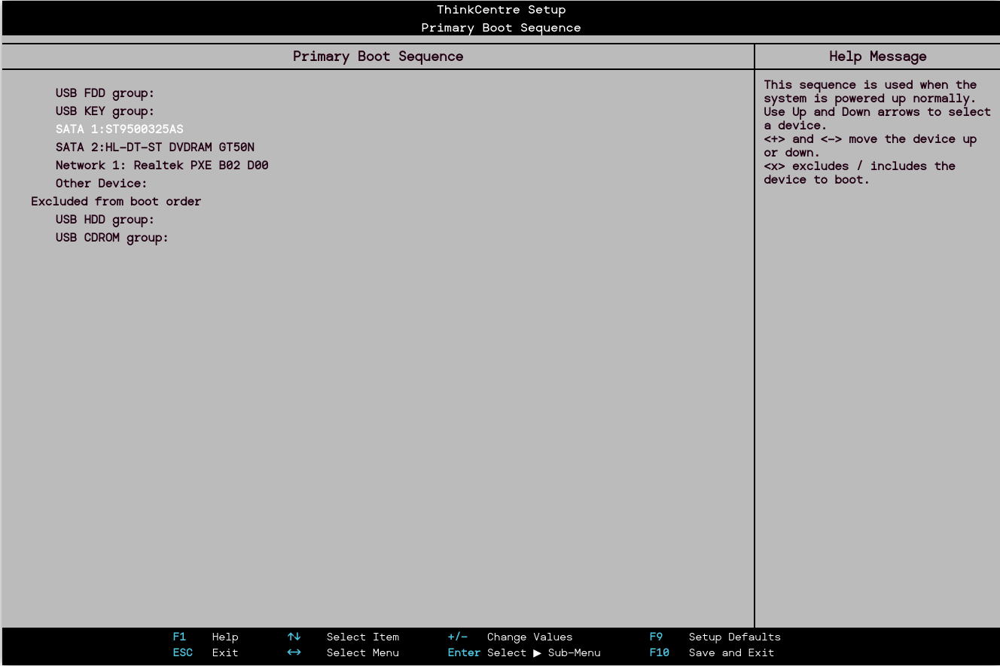

author: Gonzalo
summary: Proyecto BIOS
id: GonzaloPulido_BIOS
categories: codelab,markdown
environments: Web
status: Draft

# Guía para Bastionar la BIOS/UEFI

## 1\. Configuración de Contraseña de Usuario o Power-On

La **contraseña de usuario** o **Power-On** impide el acceso no autorizado al sistema durante el arranque. Aquí te explicamos cómo configurarla:

**Acceso a BIOS/UEFI**: Reinicia tu ordenador y presiona la tecla correspondiente (comúnmente `F2`, `F10`, `Del` o `Esc`) para entrar en la configuración de BIOS/UEFI.

**Buscar la opción de seguridad**: Navega a la sección de "Security" o "Security Settings".

**Configurar la contraseña**:
- Selecciona la opción "Set User Password" o "Set Supervisor Password".
  
- Introduce la contraseña deseada y confírmala.
  
- Guarda los cambios y sal de la BIOS/UEFI.

## 2\. Configuración de Contraseña de Administrador

La **contraseña de administrador** ofrece un nivel adicional de seguridad al restringir los cambios en la configuración de la BIOS/UEFI.

**Acceso a BIOS/UEFI**: Reinicia el ordenador y accede a la configuración de BIOS/UEFI.

**Buscar la opción de seguridad**: Ve a la sección de "Security" o "Security Settings".

**Establecer la contraseña**:

- Selecciona "Set Supervisor Password".
- Introduce y confirma la nueva contraseña.
- Guarda los cambios y sal de la BIOS/UEFI.

## 3\. Prevención de Arranques Externos

Para evitar que el sistema arranque desde dispositivos externos (como USB, CD/DVD), sigue estos pasos:

**Acceso a BIOS/UEFI**: Entra en la configuración de BIOS/UEFI durante el arranque.

**Buscar la opción de arranque**: Navega a la sección de "Boot" o "Boot Options".

**Desactivar dispositivos externos**:

  - Encuentra las opciones relacionadas con "Boot Order" o "Boot Device Priority".

  - Desactiva el arranque desde USB o dispositivos externos, o mueve el disco duro interno a la parte superior de la lista de arranque.

  

**Guardar cambios**: Asegúrate de guardar los cambios antes de salir.

## 4\. Establecimiento de un Orden de Arranque Seguro

Configurar un orden de arranque seguro asegura que el sistema siempre intente arrancar desde el disco duro antes de otros dispositivos.

**Acceso a BIOS/UEFI**: Accede a la configuración durante el arranque.

**Buscar la opción de arranque**: Ve a la sección de "Boot" o "Boot Order".

**Configurar el orden**:
  - Asegúrate de que tu disco duro o SSD está en la parte superior de la lista.
  - Desactiva o mueve dispositivos que no sean necesarios.
  
**Guardar cambios**: Guarda la configuración antes de salir.

## 5\. Otras Opciones de Seguridad

Además de las contraseñas y la configuración del arranque, considera implementar las siguientes opciones de seguridad:

-   **Secure Boot**: Asegúrate de que la opción de "Secure Boot" esté habilitada. Esto ayuda a prevenir la carga de software malicioso durante el arranque.

